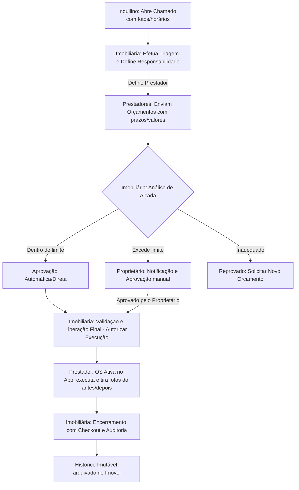

# Arquitetura do Sistema - Occasio.Imob 💡🏢

Este documento detalha as definições de arquitetura, fluxos de negócio, permissões e padrões técnicos a serem seguidos no desenvolvimento do **Occasio.Imob**.

---

## 🔑 Perfis de Usuário & Políticas de Acesso (RLS)

O banco de dados (Supabase PostgreSQL) implementará políticas de segurança estritas baseadas em linhas (Row Level Security - RLS). Nenhuma consulta poderá expor dados de outras organizações.

| Perfil | Nível de Acesso | Ações Principais |
| :--- | :--- | :--- |
| **Super Admin** | Total e irrestrito (ex: equipe Occasio) | Auditoria geral, suporte técnico e capacidade de alternar entre perfis para homologação do fluxo. |
| **Imobiliária** | Apenas à sua própria carteira | Cadastro exclusivo de imóveis, triagem de chamados, direcionamento, aprovação de alçadas, liberação de OS. |
| **Inquilino** | Apenas ao seu imóvel locado | Abertura de chamados, envio de mídias (fotos/vídeos), acompanhamento de status. |
| **Prestador** | Suas próprias OS e orçamentos | Visualização de chamados recebidos, envio de orçamentos, fotos de antes/depois, relatórios de conclusão. |
| **Proprietário** | Seus imóveis associados | Visualização de relatórios, aprovação/reprovação de despesas que excedem a alçada de aprovação direta da imobiliária. |

---

## 🔄 Fluxo de Ciclo de Vida do Chamado (Manutenção)

O fluxo principal do chamado percorre os seguintes estados:

---

## 📁 Diretrizes Técnicas

### 📷 Gerenciamento e Compressão de Imagens
- **Regra**: Imagens enviadas em campo (tanto por Inquilinos no chamado quanto por Prestadores na execução) devem ser comprimidas client-side para no máximo **2MB** antes do upload para o Supabase Storage.
- **Auditoria**: O sistema gravará de forma imutável a data/hora e o ID do usuário responsável por qualquer upload, alteração ou exclusão de mídias.

### ⚡ Atualizações em Tempo Real (Real-time)
- Interfaces de controle crítico (listagem de OS da Imobiliária e painel de execução do Prestador) utilizarão listeners em tempo real (`Supabase Realtime`) ou invalidação proativa de cache (`React Query` / `SWR`) para que o status mude na tela instantaneamente após qualquer aprovação ou finalização.

### 📶 Resiliência Offline (PWA)
- Prestadores operando em subsolos, áreas remotas ou sem rede devem conseguir listar suas Ordens de Serviço ativas e armazenar dados de conclusão temporariamente em cache local (`IndexedDB` ou `localStorage`), sincronizando-os automaticamente assim que a conexão for restabelecida.
